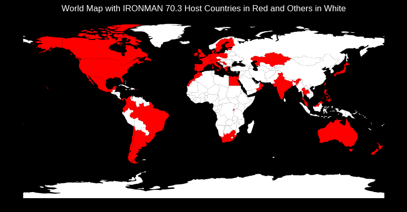

      

:swimming_man:  This a is a regression case that aims to estimate the finish time of a half ironman based on the age, the gender and half-marathon time calculated with known marathon average pace (as you don't run a half marathon alone as quickly as you run a half marathon after swimming and cycling).

:bike: The dataset consists of Ironman 70.3 race records around the world registered between 2010 and 2020, including as main columns the tri-athlete´s gender, age group, country of origin, the year and the location of the race, and the partial (swim, bike, run, transitions) and full race finish times (in seconds).
Several models were tested : Linear Regression, Ridge Regression, Lasso Regression, Random Forest, Gradient Boosting, and XGBoost.

:running:The best model was kept for prediction. 

Limits: no information on weather, elevation, number of supporters along the course, number of refueling sites on the course, and you have elites and amateurs athletes mixed in the dataset.

